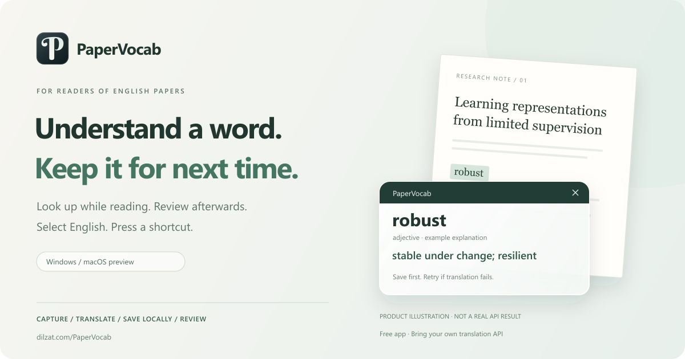

<p align="center"><a href="README.md">简体中文</a> · <a href="README.en.md"><strong>English</strong></a></p>

# PaperVocab



<p align="center"><strong>Select English → Press a shortcut → See its meaning → Save locally → Review later</strong></p>
<p align="center"><a href="https://dilzat.com/PaperVocab/">Product site</a> · <a href="#download">Download</a> · <a href="docs/GETTING_STARTED.en.md">Getting started</a> · <a href="https://github.com/DilzatAzat/PaperVocab/issues/new?template=onboarding_feedback.yml">Share your experience</a></p>

PaperVocab is a desktop vocabulary companion for reading English research papers. Select a word in a PDF or browser and press a shortcut: the original text is saved locally, then an explanation appears in a compact popup. After reading, return to your library to search, filter by date, or do a short review.

**For students, researchers and engineers who read English papers and already have access to a translation API.** The app is free, MIT licensed, and needs no PaperVocab account. Translation requires your own API URL, model and key; the provider may charge for requests. The desktop interface currently uses Chinese.

## Download

Use a packaged installer. You do not need Node.js, Rust or a development terminal.

| Platform | Installer | Requirements and version |
| --- | --- | --- |
| Windows | [Download Windows x64](https://github.com/DilzatAzat/PaperVocab/releases/download/v0.1.0/PaperVocab_0.1.0_x64-setup.exe) | Windows 10/11 · v0.1.0 |
| Mac · M series | [Download Apple Silicon](https://github.com/DilzatAzat/PaperVocab/releases/download/macos-v0.1.0-beta.1/PaperVocab_0.1.0_aarch64.dmg) | macOS 11+ · Preview |
| Mac · Intel | [Download Intel Mac](https://github.com/DilzatAzat/PaperVocab/releases/download/macos-v0.1.0-beta.1/PaperVocab_0.1.0_x64.dmg) | macOS 11+ · Preview |

Windows: run the installer and launch from the desktop or Start menu. If WebView2 is missing, installation needs internet access to download it. Mac: choose the DMG for your chip, move the app into Applications, and follow Settings to grant Accessibility access before capturing words.

**This is an early release.** The Windows package is unsigned and may trigger Edge's uncommon-download warning, an unknown publisher message or SmartScreen. The Mac preview has no Developer ID signing or notarization. See the [Windows release and checksums](https://github.com/DilzatAzat/PaperVocab/releases/tag/v0.1.0), [Mac release and checksums](https://github.com/DilzatAzat/PaperVocab/releases/tag/macos-v0.1.0-beta.1), and [download notes](docs/DOWNLOAD_TRUST.md). Full real PDF, real API and install/uninstall acceptance is still being completed; compatibility with every reader is not claimed.

## Start with one word

1. **Configure translation.** Open Settings and enter your provider's API Base URL, model ID and API key. Choose a target language and save.
2. **Capture a selection.** Select a word in a copyable English PDF or browser. The default shortcut is `Ctrl+Shift+L` on Windows or `⌘+Shift+L` on Mac. Release the keys and wait for the explanation; use the shortcut actually registered in Settings.
3. **Revisit and review.** Open the word library (收词汇总), search or filter by first collection date. In due reviews (到期复习), reveal the meaning and choose Unknown / Somewhat familiar / Known.

If capture fails, the main window offers manual input as a fallback. Closing the main window keeps the app in the tray/menu bar; choose Quit from its menu to exit completely.

Unsure what to enter? The [getting started guide](docs/GETTING_STARTED.en.md) explains the fields and common failures. **Saving settings does not verify the API.** Start with a public test word such as `robust` and complete one translation.

## Useful while reading

| What you need | What PaperVocab does |
| --- | --- |
| Understand a word and keep reading | A global shortcut and compact popup with part of speech, meaning and a brief explanation |
| Keep the word when a request fails | Saves to local SQLite before translating; the original remains available for retry |
| Notice the same word again | Reuses successful cached explanations and adds an encounter |
| Find yesterday's words | One library, total word count, search and first collection date filter |
| Remember what you read | Due reviews, reveal on request, and three ratings; an encounter is separate from a review |
| Choose your own translation service | Configure a service compatible with the OpenAI Chat Completions protocol |

Explanation languages: **Chinese, English, German, French and Japanese**, with Chinese as the default. The source is English paper text. This setting changes the explanation language, not the app interface. Each word currently keeps its latest explanation in one target language and can be translated again after switching.

The image above illustrates the product flow. Its example explanation is not a real API acceptance record. Real desktop recordings and additional reader tests will be added after verification.

## Questions

**Does it require OpenAI?** It implements the **OpenAI Chat Completions compatible protocol**, rather than requiring OpenAI as the provider. Other services can be configured if their request and response formats are compatible. Native Anthropic Messages, native Gemini APIs and other protocols are not supported directly. Protocol support does not mean every provider or model has been tested.

**Can I use it offline?** Saved vocabulary and explanations can be viewed and reviewed offline. New explanations use your configured API and normally require a network connection. No API key, translation credits or offline dictionary is included.

**Where do my words and keys go?** The library stays on your device. Keys use Windows Credential Manager or macOS Keychain. Translation sends the collected text to your chosen provider, whose privacy and billing policies apply. The app does not continuously upload clipboard history. Read the [Privacy policy](PRIVACY.md).

**Does it work with scanned PDFs?** There is no OCR. Capture requires selectable, copyable text. Scanned images and PDFs that prohibit copying may fail; manual input does not validate global capture.

**Is there a mobile app or sync?** There are no mobile apps, accounts or cloud sync, and PaperVocab does not include a PDF reader. JSON backup backend commands exist; the complete import/export interface remains unfinished.

## Help it grow

If PaperVocab helps your reading, share the [product site](https://dilzat.com/PaperVocab/) with someone who reads papers, or Star the repository to follow future versions.

One real experience is especially useful: your OS and reader, whether your first translation worked, and where you got stuck. [Share your experience](https://github.com/DilzatAzat/PaperVocab/issues/new?template=onboarding_feedback.yml) · [Report a bug](https://github.com/DilzatAzat/PaperVocab/issues/new?template=bug_report.yml). Keep API keys, private libraries and full paper text out of public reports.

Read [CONTRIBUTING.md](CONTRIBUTING.md) before contributing code and use [SECURITY.md](SECURITY.md) for private security reports. Reader testing, a clearer setup flow and additional API protocols are welcome contributions.

<details>
<summary>Development, builds and verification</summary>

Tauri 2 + React / TypeScript + Rust + SQLite. `master` mainly maintains the public site. Choose the platform branch for desktop work: [Windows](https://github.com/DilzatAzat/PaperVocab/tree/codex/windows) / [macOS](https://github.com/DilzatAzat/PaperVocab/tree/codex/macos), and run desktop builds on that platform.

```bash
git clone https://github.com/DilzatAzat/PaperVocab.git
cd PaperVocab
git switch codex/windows  # Use codex/macos for Mac
pnpm install --frozen-lockfile
pnpm test
pnpm exec tsc --noEmit
pnpm tauri dev
```

Build with `pnpm tauri build`: NSIS on Windows, app/DMG on Mac. See [AGENTS.md](AGENTS.md) for real commands and the recovery entry point, and the [Windows](docs/WINDOWS_TEST.md) / [Mac](docs/MACOS_TEST.md) acceptance checklists. A build is not a substitute for desktop acceptance. Signing status is documented in the [Code signing policy](CODE_SIGNING_POLICY.md).

</details>

## License

[MIT](LICENSE). The icon's font outlines have a separate [Berkshire Swash font license](src-tauri/icons/BerkshireSwash-OFL.txt).
