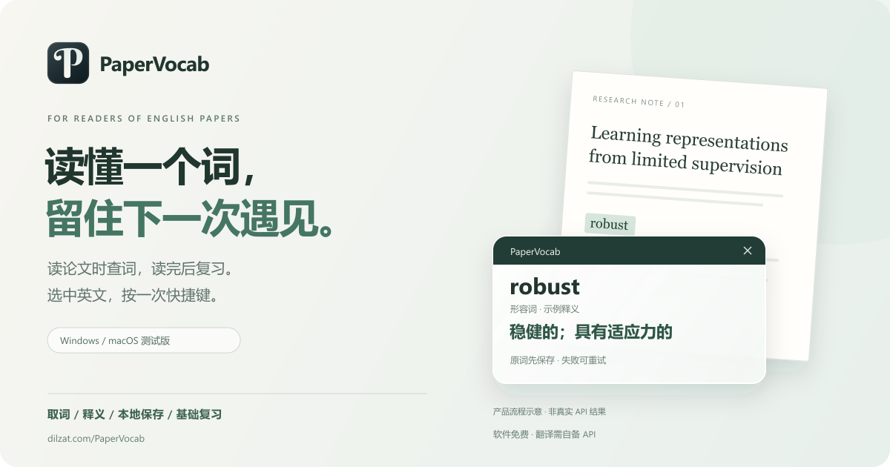

<p align="center"><a href="README.md"><strong>简体中文</strong></a> · <a href="README.en.md">English</a></p>

# PaperVocab



<p align="center"><strong>选中英文 → 按快捷键 → 查看释义 → 留在本地词本 → 稍后复习</strong></p>
<p align="center"><a href="https://dilzat.com/PaperVocab/">产品主页</a> · <a href="#下载">下载安装</a> · <a href="docs/GETTING_STARTED.md">首次使用指南</a> · <a href="https://github.com/DilzatAzat/PaperVocab/issues/new?template=onboarding_feedback.yml">反馈使用体验</a></p>

PaperVocab 是为英文论文阅读设计的桌面词汇伴侣。遇到生词时，在 PDF 或浏览器中选中它，按一次快捷键：原词先保存到本地，随后在小浮窗中显示释义。读完再打开词本，搜索、按日期找回，或完成一次简单复习。

**适合经常读英文论文、已有翻译 API 的学生、研究者和工程师。** 软件免费、MIT 开源，无需 PaperVocab 账号；翻译需要你自己的 API 地址、模型和密钥，服务商可能收费。当前桌面界面为中文。

## 下载

普通用户直接下载安装包，无需安装 Node.js、Rust 或打开开发终端。

| 平台 | 安装包 | 系统要求与版本 |
| --- | --- | --- |
| Windows | [下载 Windows x64](https://github.com/DilzatAzat/PaperVocab/releases/download/v0.1.0/PaperVocab_0.1.0_x64-setup.exe) | Windows 10/11 · v0.1.0 |
| Mac · M 系列 | [下载 Apple Silicon](https://github.com/DilzatAzat/PaperVocab/releases/download/macos-v0.1.0-beta.1/PaperVocab_0.1.0_aarch64.dmg) | macOS 11+ · 测试版 |
| Mac · Intel | [下载 Intel Mac](https://github.com/DilzatAzat/PaperVocab/releases/download/macos-v0.1.0-beta.1/PaperVocab_0.1.0_x64.dmg) | macOS 11+ · 测试版 |

Windows：双击安装，从桌面或开始菜单打开。缺少 WebView2 时，安装器需要联网下载运行时。Mac：选择对应芯片的 DMG，将应用拖入“应用程序”；取词前按设置指引授予辅助功能权限。

**当前是早期版本。** Windows 包未签名，可能出现 Edge“通常不会下载”、未知发布者或 SmartScreen 提示；Mac 测试版尚无 Developer ID 签名和公证。请查看 [Windows 发布说明与校验文件](https://github.com/DilzatAzat/PaperVocab/releases/tag/v0.1.0)、[Mac 发布说明与校验文件](https://github.com/DilzatAzat/PaperVocab/releases/tag/macos-v0.1.0-beta.1)及[下载说明](docs/DOWNLOAD_TRUST.md)。完整真实 PDF、真实 API 和安装卸载验收仍在补齐，不承诺所有阅读器均兼容。

## 从第一个词开始

1. **配置翻译。** 打开“设置”，填入服务商提供的 API Base URL、模型 ID 和 API 密钥，选择目标语言后保存。
2. **选词取词。** 在可复制文本的英文 PDF 或浏览器中选一个词。Windows 默认按 `Ctrl+Shift+L`，Mac 默认按 `⌘+Shift+L`；松开组合键，等待释义。以设置中实际注册的快捷键为准。
3. **找回并复习。** 在“收词汇总”查看已保存单词，使用搜索或首次收录日期筛选。进入“到期复习”，先看英文，再主动查看释义并选择“不认识 / 有点印象 / 认识”。

没选到文本？可使用主窗口的手动输入备用入口。关闭主窗口会继续在托盘/菜单栏运行，从图标菜单选择退出才完全结束。

第一次配置不确定填什么？[首次使用指南](docs/GETTING_STARTED.md)给出字段说明和常见错误处理。**“设置已保存”不代表 API 已调用成功**，请先用 `robust` 这样的公开测试词完成一次翻译。

## 阅读时用得上的功能

| 阅读中的需要 | PaperVocab 的做法 |
| --- | --- |
| 遇到一个词，继续读下去 | 全局快捷键取词，小浮窗查看词性、简洁释义和必要解释 |
| 请求失败，也想留住原词 | 先写入本地 SQLite，再请求翻译；失败后保留原词并可重试 |
| 同一个词反复出现 | 优先使用已成功翻译的缓存，追加遇见记录 |
| 想找回昨天收的词 | 统一收词汇总、词库总数、搜索和首次收录日期筛选 |
| 想把生词记住 | 到期复习、主动揭示释义、三档反馈；重复遇见不等于完成复习 |
| 希望自己选择翻译服务 | 使用兼容 OpenAI Chat Completions 协议的 API，自选地址和模型 |

目标语言可选 **中文、English、Deutsch、Français、日本語**，默认中文。源文本面向英文论文；这是释义语言选择，不是桌面界面语言切换。目前每个词保留最近一种目标语言释义，切换后可重新翻译。

顶部图片是产品流程示意，示例释义不是真实 API 验收记录。真实录屏和更多阅读器测试会在验证后补充。

## 常见问题

**只能用 OpenAI 吗？** 不是必须使用 OpenAI 的服务。当前实现的是 **OpenAI Chat Completions 兼容协议**；其他服务只要接口与响应结构兼容，也可配置。原生 Anthropic Messages、Gemini 原生 API 等不同协议暂不支持直接接入。配置兼容接口不代表全部服务商或模型都已实测。

**可以离线使用吗？** 已保存的词库和释义可离线查看、复习；新释义通过配置的 API 请求，通常需要联网。软件不附带 API 密钥、翻译额度或离线词典。

**我的词库和密钥会上传吗？** 词库保存在本机，密钥由 Windows 凭据管理器或 macOS Keychain 保存。翻译时，所收文本会发送到你选择的 API 服务；其隐私和收费政策适用。程序不持续上传剪贴板历史。详见[隐私政策](PRIVACY.md)。

**扫描 PDF 能取词吗？** 当前没有 OCR，需要阅读器里可选中、可复制的文本。扫描图片、禁止复制的 PDF 可能失败，不能靠手动入口证明全局取词正常。

**可以在手机上用或自动同步吗？** 当前没有手机端、账号或云同步，也不是自带 PDF 阅读器。JSON 备份后端已实现，完整导入导出界面仍待补齐。

## 一起把它做得更好

如果 PaperVocab 对你的阅读有帮助，欢迎分享[产品主页](https://dilzat.com/PaperVocab/)给同样读论文的人，或给项目一个 Star，方便关注后续版本。

更有价值的反馈是一次真实使用：你用什么系统和阅读器、是否完成第一个词的翻译、卡在哪一步。[提交使用体验](https://github.com/DilzatAzat/PaperVocab/issues/new?template=onboarding_feedback.yml) · [报告问题](https://github.com/DilzatAzat/PaperVocab/issues/new?template=bug_report.yml)。不要公开提交密钥、私人词库或论文全文。

代码贡献请先读 [贡献指南](CONTRIBUTING.md)；安全问题按 [SECURITY.md](SECURITY.md) 私下报告。欢迎帮助验证不同阅读器、改进首次配置流程和适配更多 API 协议。

<details>
<summary>开发、构建与验证</summary>

Tauri 2 + React / TypeScript + Rust + SQLite。`master` 主要维护公开主页；桌面开发先选择对应分支：[Windows](https://github.com/DilzatAzat/PaperVocab/tree/codex/windows) / [macOS](https://github.com/DilzatAzat/PaperVocab/tree/codex/macos)。请在对应平台运行桌面程序。

```bash
git clone https://github.com/DilzatAzat/PaperVocab.git
cd PaperVocab
git switch codex/windows  # Mac 使用 codex/macos
pnpm install --frozen-lockfile
pnpm test
pnpm exec tsc --noEmit
pnpm tauri dev
```

打包：`pnpm tauri build`，Windows 生成 NSIS，Mac 生成 app/DMG。实际命令和恢复入口见 [AGENTS.md](AGENTS.md)，系统交互验证见 [Windows 清单](docs/WINDOWS_TEST.md) / [Mac 清单](docs/MACOS_TEST.md)。构建成功不等于这些项目已验收。签名状态见 [Code signing policy](CODE_SIGNING_POLICY.md)。

</details>

## 许可证

[MIT](LICENSE)。图标使用的字体轮廓许可另见 [Berkshire Swash 字体许可](src-tauri/icons/BerkshireSwash-OFL.txt)。
